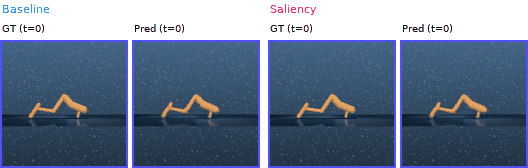

# Reward Gradient Saliency for World Model Training

**Sunghwan Kim · Benjamin Nguyen** `{suk063, B0nguyen}@ucsd.edu`

Department of Electrical and Computer Engineering, UC San Diego


## Table of Contents

1. [Project Summary](#1-project-summary)
2. [Background and Motivation](#2-background-and-motivation)
3. [Method](#3-method)
4. [Repository Structure](#4-repository-structure)
5. [Installation](#5-installation)
6. [Data Preparation](#6-data-preparation)
7. [Training](#7-training)
8. [Evaluation](#8-evaluation)
9. [Results](#9-results)
10. [Hyperparameters](#10-hyperparameters)
11. [Checkpoint](#11-checkpoint)
12. [Citation and Acknowledgements](#12-citation-and-acknowledgements)

---

## 1. Project Summary

We introduce **reward gradient saliency**, a lightweight modification to Dreamer4's dynamics training that replaces its uniform spatial-token loss with a weighted variant. A small auxiliary reward head (two-layer MLP, ~8K parameters) predicts scalar reward from mean-pooled spatial tokens. The gradient of that prediction with respect to each token identifies which tokens encode task-relevant information. Those gradients are normalized into per-token weights and applied to the dynamics loss — concentrating prediction capacity on task-critical regions without modifying the underlying architecture.

Evaluated on 30 DMControl and MMBench tasks, saliency weighting improves latent prediction on **18/30 tasks** with an aggregate −5.6% reduction in Latent MSE. The largest gains occur on tasks with spatially localized rewards: finger-turn-easy (−61.5%), reacher-3-hard (−74.8%), and walker-walk (−27.5%). The method adds fewer than 0.04% additional parameters and ~4% wall-clock overhead.

---

## 2. Background and Motivation

Dreamer4 is a two-stage world model:

- **Stage 1 — Causal Tokenizer:** A Block-Causal Transformer encodes visual observations into compact latent tokens via a masked autoencoder (MAE) objective.
- **Stage 2 — Interactive Dynamics Model:** A second transformer predicts future latent states conditioned on actions, using a flow-matching (shortcut forcing) objective.

The dynamics model trains with a **uniform loss** averaged across all spatial tokens:

```
L_dyn = (1 / Sz) · Σ_i || ẑ1(i) − z1(i) ||²
```

This treats every spatial token equally, regardless of its relevance to the task reward. In practice, for a task like `finger-turn-easy`, only 1–2 of the 8 spatial tokens encode the actuated finger-tip and target angle, while the remaining 6–7 encode the static background hinge. Uniform weighting devotes ~75–85% of gradient signal to tokens that barely change between frames, starving the task-critical tokens.

**Our contribution:** replace uniform averaging with a reward-gradient-derived spatial weighting that is computed cheaply, requires no architectural changes, and degrades gracefully to the standard objective when the reward signal provides no spatial contrast.

---

## 3. Method

### 3.1 Causal Tokenizer (Stage 1, unchanged)

Given an observation `x_t ∈ R^(C×H×W)`, the tokenizer divides it into non-overlapping 4×4 patches and encodes them through a Block-Causal Transformer with `Nz = 16` learnable latent tokens:

```
z_t = tanh(W_b · Enc_φ(x_t^(p))) ∈ R^(Nz × Dz)
```

The tokenizer is pre-trained with an MAE reconstruction loss (`MSE + 0.2 × LPIPS`) and **frozen** for all dynamics experiments.

### 3.2 Spatial Packing

Before entering the dynamics model, the `Nz` bottleneck tokens are packed by concatenating adjacent groups of `k`:

```
z_t^(s) ∈ R^(Sz × Ds),   Sz = Nz / k,   Ds = k · Dz
```

With `k = 2`: 16 tokens of dim 32 → 8 spatial tokens of dim 64.

### 3.3 Dynamics Model — Shortcut Forcing (Stage 2, unchanged)

A noisy input is constructed by interpolating between Gaussian noise `z0` and the clean target `z1` at noise level `σ ∈ [0, 1]`:

```
z̃_t = (1 − σ) · z0 + σ · z1
```

The dynamics model learns to recover `z1` from the noisy input, conditioned on actions, task embeddings, and shortcut indices:

```
ẑ1 = Dyn_θ(a_{1:t}, e_{1:t}, σ_{1:t}, z̃_{1:t})
```

### 3.4 Auxiliary Reward Head (ours)

A two-layer MLP `f_ψ` maps mean-pooled spatial tokens to a scalar reward estimate:

```
r̂_t = f_ψ( (1/Sz) · Σ_i z_t^(s,i) )
```

Hidden dimension: 128, activation: ReLU. Trained jointly with dynamics via MSE:

```
L_rew = || r̂_t − r_t ||²
```

### 3.5 Reward Gradient Saliency Mask (ours)

The per-token gradient of the predicted reward is computed with a single backward pass through the reward head (not the frozen encoder):

```
g_t = ∂r̂_t / ∂z_t^(s)  ∈ R^(Sz × Ds)
```

Gradient magnitudes are averaged across the token's feature dimension to produce a scalar saliency score per token:

```
s_t(i) = (1/Ds) · Σ_d |g_t(i, d)|
```

Scores are min-max normalized into weights in `[δ, 1]`:

```
w_t(i) = max( δ,  (s_t(i) − min_j s_t(j)) / (max_j s_t(j) − min_j s_t(j) + ε) )
```

`δ = 0.1` ensures no token is fully ignored. The mask is **detached** before entering the loss (no second-order gradients) and cached every `k_sal = 5` steps to amortize cost.

### 3.6 Warm-up Schedule

Before the reward head converges, its gradients are noisy and could corrupt the dynamics loss. A linear warm-up interpolates from uniform to saliency-weighted over the first `T_warmup` steps:

```
w_t^final(i) = (1 − α_t) + α_t · w_t(i),   α_t = min(1, t / T_warmup)
```

### 3.7 Weighted Dynamics Loss

The final training objective:

```
L_weighted = Σ_i w_t(i) · || ẑ1(i) − z1(i) ||²  /  Σ_i w_t(i)

L(θ, ψ) = L_weighted + λ_rew · L_rew
```

The denominator normalizes by total weight, so the loss recovers the standard uniform objective when all weights are equal. Gradients flow through the dynamics model `θ` and reward head `ψ`; the tokenizer `φ` remains frozen throughout.

---

## 4. Repository Structure

```
dreamer4/
├── dreamer4/                           # Main package (run all scripts from here)
│   ├── model.py                        # All model classes:
│   │                                   #   BlockCausalTransformer, Encoder, Decoder,
│   │                                   #   Tokenizer, Dynamics, RewardHead
│   ├── train_tokenizer.py              # Stage 1 training (8-GPU DDP, WandB, LPIPS)
│   ├── train_dynamics.py               # Stage 2 baseline training
│   ├── train_dynamics_weighting.py     # Stage 2 + saliency reward weighting (ours)
│   ├── eval.py                         # Standalone evaluation: MSE, PSNR, SSIM, LPIPS
│   ├── compare_eval                    # Compare evals generated by eval.py
│   ├── interactive.py                  # aiohttp WebSocket server + browser UI
│   ├── preprocess_dataset.py           # Raw PNGs → sharded uint8 .pt files
│   ├── sharded_frame_dataset.py        # Frame dataset (tokenizer training)
│   ├── wm_dataset.py                   # Trajectory dataset (dynamics training)
│   ├── task_set.py                     # List of 30 DMControl task names
│   └── logs/                           # Created at runtime; stores checkpoints
├── tasks.json                          # Per-task: action_dim, episode steps,
│                                       #   text instruction, 512-dim language embedding
├── environment.yaml                    # Conda environment spec
└── README.md
```

### Key Model Classes (`model.py`)

| Class | Role |
|---|---|
| `BlockCausalTransformer` | Shared backbone; alternates space attention (within timestep) and causal time attention (across timesteps) |
| `Encoder` | Patchifies frames, runs transformer in `"encoder"` space mode, projects to bottleneck latents |
| `Decoder` | Reconstructs masked patches from latents in `"decoder"` space mode |
| `Tokenizer` | Wraps Encoder + Decoder; handles MAE masking and reconstruction loss |
| `Dynamics` | Transformer in `"wm_agent_isolated"` / `"wm_agent"` space mode; predicts future spatial tokens |
| `RewardHead` | Two-layer MLP; mean-pools spatial tokens → scalar reward estimate **(our addition)** |

### Token Sequence per Timestep (Dynamics)

```
ACTION | SHORTCUT_SIGNAL | SHORTCUT_STEP | SPATIAL (8 packed latents) | REGISTER | AGENT
```

---

## 5. Installation

**Requirements:** CUDA-capable GPU(s), Conda.

```bash
# Clone the repository
git clone <repo-url>
cd dreamer4

# Create and activate the conda environment
conda env create -f environment.yaml
conda activate dreamer4
```

The environment includes PyTorch 2.8, `wandb`, `lpips`, `aiohttp`, and DMControl dependencies. See `environment.yaml` for the full spec.

---
 
## 6. Data Preparation
### Dataset
 
The dataset is available at [nicklashansen/dreamer4](https://huggingface.co/datasets/nicklashansen/dreamer4) on Hugging Face — 7,200 mixed-quality trajectories (3.6M frames) spanning 30 continuous control tasks from **DMControl** and **MMBench**.
 
### Input Format
 
Raw data should be PNG files with **horizontally stacked frames**, shape `(3, 224, N×224)` per file, accompanied by `.npz`/`.json` trajectory files containing actions and rewards.
 
### Preprocessing

Edit the `FILEDIR` (input) and `OUTDIR` (output) paths inside the script, then run:

```bash
cd dreamer4/dreamer4
python preprocess_dataset.py
```

This splits each PNG horizontally into individual frames, resizes to 128×128 (bilinear), and saves sharded `.pt` files:

```
{"frames": Tensor(2048, 3, 128, 128)}   # uint8, shard size = 2048 frames
```

Shards are written atomically (temp file → rename) to avoid corruption on preemption.

### Dataset Classes

**`ShardedFrameDataset`** (tokenizer training)
- Reads shard `.pt` files with a single-shard LRU cache
- Samples contiguous sequences of length `seq_len`
- Returns `float32` in `[0, 1]`

**`WMDataset`** (dynamics training)
- Inputs: `data_dirs` (trajectory `.npz`/`.json`) + `frames_dirs` (preprocessed shards)
- Returns per sample:

```python
{
    "obs":      Tensor(T+1, 3, H, W),  # video frames (context + horizon)
    "act":      Tensor(T, A),           # actions
    "act_mask": Tensor(T, A),           # per-task action validity mask
    "rew":      Tensor(T,),             # rewards
    "lang_emb": Tensor(512,),           # 512-dim task text embedding (from tasks.json)
    "emb_id":   Tensor(),               # task index (int)
}
```

Action dimensions are masked to each task's `action_dim` from `tasks.json`. Language embeddings are pre-extracted 512-dim vectors stored in `tasks.json` alongside task metadata.

---

## 7. Training

> **All scripts must be run from `dreamer4/dreamer4/`** (the inner package directory), not the repo root.

### Stage 1 — Tokenizer

```bash
cd dreamer4/dreamer4

# Full training (8 GPUs, WandB logging, LPIPS loss)
torchrun --nproc_per_node=8 train_tokenizer.py

```

**What it does:** trains the Encoder + Decoder on random-masked frame reconstruction. Loss = `MSE(masked patches) + 0.2 × LPIPS`. Saves checkpoints to `logs/tokenizer_ckpts/`.

Key hyperparameters: `d_model=256`, `n_heads=4`, `depth=8`, `n_latents=16`, `d_bottleneck=32`, `lr=1e-4`, `batch_size=8`.

---

### Stage 2 — Dynamics (Baseline)

```bash
torchrun --nproc_per_node=8 train_dynamics.py --use_actions
```

Loads the frozen tokenizer checkpoint. Trains the dynamics transformer with uniform shortcut-forcing loss. Two loss components per batch:
- **Empirical rows (75%):** `σ = k_max` (finest noise level)
- **Self-supervised rows (25%):** `σ ~ Uniform`
- **Bootstrap loss (after step 5000):** multi-step velocity prediction

---

### Stage 2 — Dynamics with Saliency Weighting (Ours)

```bash
torchrun --nproc_per_node=8 train_dynamics_weighting.py --use_actions --reward_weight <λ>
```

Same as baseline, plus:
- Instantiates and trains `RewardHead` jointly with the dynamics model
- Computes `∂r̂/∂z^(s)` every `k_sal` steps and caches the saliency mask
- Applies warm-up schedule for first `T_warmup` steps
- Saves `reward_head` state dict alongside dynamics in checkpoints

Checkpoints saved to `logs/dynamics_ckpts/` as `latest.pt` and periodic `step_XXXXX.pt` snapshots.

---
## 8. Evaluation

### Standalone Evaluation
```bash
python eval.py --ckpt <path_to_checkpoint>
```

Loads a dynamics checkpoint, runs autoregressive rollouts on held-out sequences, and reports:

| Metric | Description |
|---|---|
| **Latent MSE** | Primary metric — prediction error in the latent space where planning operates |
| PSNR | Pixel-space fidelity after decoding |
| SSIM | Structural similarity after decoding |
| LPIPS | Perceptual similarity after decoding |

**Rollout protocol:** condition on 8 ground-truth context frames; autoregressively predict 16 future frames using the shortcut schedule (`d = 0.25`, `K = 4`). Evaluate on 16 held-out sequences per task.

### In-Training Evaluation

`train_dynamics.py` runs an evaluation rollout every N steps and logs per-timestep MSE and PSNR to WandB, along with a "floor baseline" that repeats the last context frame.

### Interactive UI
```bash
python interactive.py
# Open http://localhost:7860 in a browser
```

Runs an `aiohttp` WebSocket server with an HTML/JS frontend for real-time sampling and inspection of model rollouts.

### Comparison Analysis

To compare a baseline and saliency checkpoint side-by-side:
```bash
python compare_eval.py \
    --baseline_dir ./eval_output_baseline \
    --saliency_dir ./eval_output_saliency \
    --output_dir ./eval_output_comparison
```

Loads `eval_results.json` from both runs and produces the following outputs in `--output_dir`:

| File | Description |
|---|---|
| `comparison_table.csv` | Per-task metrics (PSNR, SSIM, LPIPS, Latent MSE, Cosine Similarity) with baseline, saliency, and delta columns |
| `horizon_comparison.pdf` | 6-panel figure of metric curves over rollout steps t=1…16, with a repeat-last-frame floor baseline |
| `per_task_comparison.pdf` | Grouped bar charts for all 30 tasks across PSNR, SSIM, LPIPS, and Latent MSE |
| `aggregate_summary.pdf` | Single bar chart of aggregate metrics across all 30 tasks |
| `qualitative_comparison.png` | Side-by-side qualitative prediction grids (baseline left, saliency right) |
| `videos/<task>_comparison.gif` | Animated GIFs comparing baseline vs. saliency rollouts per task (up to 8 tasks) |
| `combined_results.json` | Combined aggregate and per-task metrics from both runs in a single JSON |

### Qualitative Example

**`hopper-hop`**



> Left: Baseline. Right: Saliency. Blue border = context frames, red border = predicted horizon frames.

## 9. Results

### Per-Task Results

Full per-task comparison across all 30 DMControl tasks. Latent MSE is the primary metric as it directly measures prediction quality in the latent space where planning operates, unlike pixel-space metrics (PSNR, SSIM) that also depend on the frozen decoder.

| Task | Base MSE | Ours MSE | ∆MSE | Base PSNR | Ours PSNR |
|---|---|---|---|---|---|
| **Locomotion** | | | | | |
| walker-walk | .0532 | .0385 | **−27.5%** | 21.28 | 21.77 |
| walker-stand | .0475 | .0653 | +37.4% | 20.74 | 20.10 |
| walker-walk-bw | .0441 | .0336 | **−23.8%** | 21.08 | 21.46 |
| walker-run-bw | .0305 | .0226 | **−25.7%** | 21.42 | 22.00 |
| walker-run | .0135 | .0130 | **−3.5%** | 24.31 | 24.67 |
| hopper-hop | .0128 | .0344 | +168.9% | 26.77 | 25.95 |
| hopper-hop-bw | .0098 | .0096 | **−2.1%** | 30.76 | 30.69 |
| hopper-stand | .0059 | .0117 | +96.7% | 32.50 | 31.75 |
| cheetah-run-front | .0112 | .0139 | +24.2% | 25.92 | 25.82 |
| cheetah-run-back | .0110 | .0075 | **−31.6%** | 26.06 | 26.18 |
| cheetah-run | .0071 | .0082 | +15.3% | 28.19 | 27.39 |
| cheetah-run-bw | .0062 | .0050 | **−19.3%** | 28.38 | 28.19 |
| cheetah-jump | .0058 | .0067 | +16.4% | 27.97 | 27.43 |
| jumper-jump | .0176 | .0115 | **−34.4%** | 28.07 | 29.39 |
| **Manipulation** | | | | | |
| cup-catch | .0251 | .0289 | +15.4% | 28.00 | 27.74 |
| cup-spin | .0226 | .0201 | **−11.0%** | 29.28 | 29.30 |
| finger-spin | .0213 | .0128 | **−39.9%** | 25.82 | 26.95 |
| finger-turn-easy | .0136 | .0052 | **−61.5%** | 26.16 | 27.01 |
| finger-turn-hard | .0118 | .0088 | **−25.5%** | 27.37 | 27.30 |
| **Reaching** | | | | | |
| reacher-3-hard | .0058 | .0015 | **−74.8%** | 29.10 | 31.19 |
| reacher-3-easy | .0026 | .0029 | +12.0% | 31.02 | 30.69 |
| reacher-easy | .0018 | .0020 | +7.0% | 31.84 | 31.44 |
| reacher-hard | .0017 | .0013 | **−21.9%** | 32.24 | 33.10 |
| **Classic Control** | | | | | |
| pendulum-spin | .0432 | .0371 | **−14.0%** | 27.63 | 27.79 |
| pendulum-swingup | .0115 | .0073 | **−36.7%** | 32.84 | 32.81 |
| acrobot-swingup | .0308 | .0319 | +3.7% | 29.65 | 29.67 |
| cartpole-swingup | .0248 | .0249 | +0.3% | 27.42 | 27.58 |
| cartpole-sw-sparse | .0056 | .0034 | **−39.8%** | 34.84 | 35.88 |
| cartpole-bal-sparse | .0021 | .0018 | **−12.7%** | 36.50 | 36.05 |
| cartpole-balance | .0012 | .0018 | +49.1% | 36.71 | 35.45 |
| **Aggregate (30 tasks)** | **.0167** | **.0158** | **−5.6%** | 28.33 | 28.42 |

Saliency benefits concentrate on **challenging tasks with localized reward-relevant dynamics**. Among the 15 hardest tasks (highest baseline Latent MSE), saliency improves 10 (67%). The most dramatic gains occur in dexterous manipulation — `finger-turn-easy` (−61.5%), `finger-spin` (−39.9%), `finger-turn-hard` (−25.5%) — where the saliency mask correctly identifies finger-tip tokens as reward-critical. Hard task variants consistently outperform their easy counterparts: `reacher-3-hard` improves by −74.8% while `reacher-3-easy` degrades by +12.0%, consistent with sparser rewards producing sharper saliency masks.

The largest degradations occur on `hopper-hop` (+168.9%) and `hopper-stand` (+96.7%), where the reward structure is spatially uniform — standing upright or hopping forward rewards the entire body configuration rather than a localized joint — leaving the saliency gradient without useful spatial contrast.

---

### Category Summary

| Category | Tasks improved | Mean ∆MSE |
|---|---|---|
| Manipulation | 4 / 5 | −24.5% |
| Reaching | 2 / 4 | −19.4% |
| Classic Control | 4 / 7 | −7.2% |
| Locomotion (excl. hopper) | 7 / 11 | −12.8% |

Manipulation tasks benefit most, confirming that saliency weighting is most effective in domains where reward depends on a spatially localized subset of the scene — fingertips, reacher arms, or pendulum angles — rather than whole-body configurations.

---

### Horizon Analysis

Latent MSE increases for both models as the autoregressive rollout progresses, reflecting compounding prediction errors. Saliency weighting provides a **compounding advantage** — better short-horizon predictions propagate into more accurate long-horizon rollouts.

| Horizon step | Baseline MSE | Ours MSE | ∆ |
|---|---|---|---|
| t = 1 | 0.0067 | 0.0065 | −3.0% |
| t = 16 | 0.0228 | 0.0211 | **−7.5%** |

Cosine similarity follows a similar trend, with the saliency model maintaining 0.9718 at t = 16 compared to 0.9708 for the baseline.

## 10. Hyperparameters

### Tokenizer (Stage 1)

| Parameter | Value |
|---|---|
| Input resolution | 128 × 128 |
| Patch size | 4 × 4 (→ 16 patches) |
| `d_model` | 256 |
| Depth / heads | 8 / 4 |
| Latent tokens `Nz` | 16 |
| Bottleneck dim `Dz` | 32 |
| Learning rate | 1e-4 |
| Batch size | 8 |
| LPIPS weight | 0.2 |

### Dynamics (Stage 2)

| Parameter | Value |
|---|---|
| `d_model` | 512 |
| Depth / heads | 8 / 4 |
| Spatial tokens `Sz` | 8 |
| Packing factor `k` | 2 |
| Batch size | 24 |
| Learning rate | 1e-4 (AdamW) |
| Gradient clipping | 1.0 |
| Training steps | 95,000 |
| Bootstrap loss start | step 5,000 |

### Saliency Variant (additional)

| Parameter | Value |
|---|---|
| Reward loss weight `λ_rew` | 0.01 |
| Warm-up steps `T_warmup` | 5,000 |
| Min saliency weight `δ` | 0.1 |
| Saliency recompute interval `k_sal` | 5 steps |
| Reward head hidden dim | 128 |

---

## 11. Checkpoint

Checkpoints are Python dicts saved with `torch.save`:

```python
{
    "step":        int,           # Global training step
    "epoch":       int,
    "model":       state_dict,    # Tokenizer weights  (key: "model")
    "dynamics":    state_dict,    # Dynamics weights   (key: "dynamics")
    "reward_head": state_dict,    # Reward head — saliency variant only
    "opt":         state_dict,    # AdamW optimizer state
    "scaler":      state_dict,    # AMP GradScaler state
    "args":        dict,          # Original argparse namespace
}
```

**Loading:**

```python
ckpt = torch.load("latest.pt", map_location="cpu")
tokenizer.load_state_dict(ckpt["model"])
dynamics.load_state_dict(ckpt["dynamics"])
reward_head.load_state_dict(ckpt["reward_head"])  # saliency variant only
```

**Pretrained checkpoint downloads:**
 
| Checkpoint | Source | Notes |
|---|---|---|
| Tokenizer | [HuggingFace (nicklashansen/dreamer4)](https://huggingface.co/nicklashansen/dreamer4/blob/main/tokenizer.pt) | Pretrained model from the original Dreamer4 repo; frozen during our experiments |
| Dynamics (baseline and ours) | [Google Drive](https://drive.google.com/file/d/1BDPh3GM7luHc3t3B3Gc_ug1kr7tWKPOj/view?usp=sharing) | Baseline and our saliency-weighted dynamics models are trained for 95K steps |
 
**Checkpoint locations (produced locally during training):**
 
| Type | Directory | Files |
|---|---|---|
| Tokenizer | `logs/tokenizer_ckpts/` | `latest.pt`, `step_XXXXX.pt` |
| Dynamics | `logs/dynamics_ckpts/` | `latest.pt`, `step_XXXXX.pt` |

---

## 12. Citation and Acknowledgements

### This Work

```bibtex
@article{kim2025saliency,
  title   = {Reward Gradient Saliency for World Model Training},
  author  = {Kim, Sunghwan and Nguyen, Benjamin},
  year    = {2025},
  note    = {Department of ECE, UC San Diego}
}
```

### Dreamer4 (base implementation)

```bibtex
@article{hafner2025dreamer4,
  title   = {Training Agents Inside of Scalable World Models},
  author  = {Hafner, Danijar and Yan, Wilson and Lillicrap, Timothy},
  journal = {arXiv preprint arXiv:2509.24527},
  year    = {2025}
}
```

### Acknowledgements

- PyTorch implementation base: [nicklashansen/dreamer4](https://github.com/nicklashansen/dreamer4)
